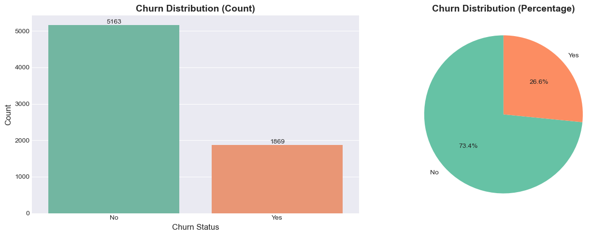
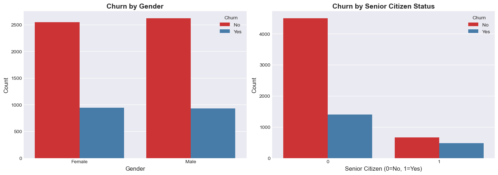
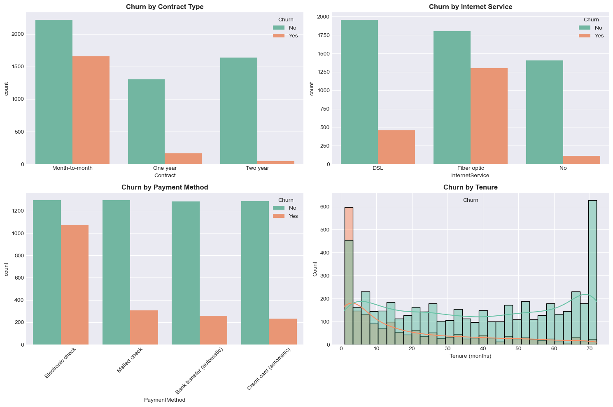
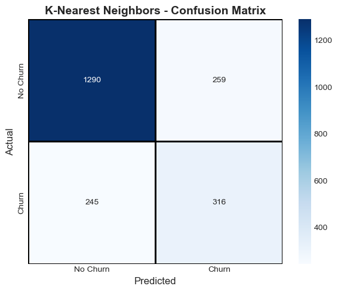
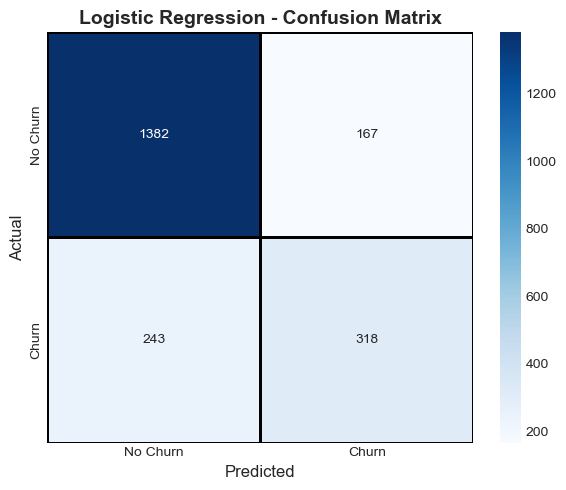
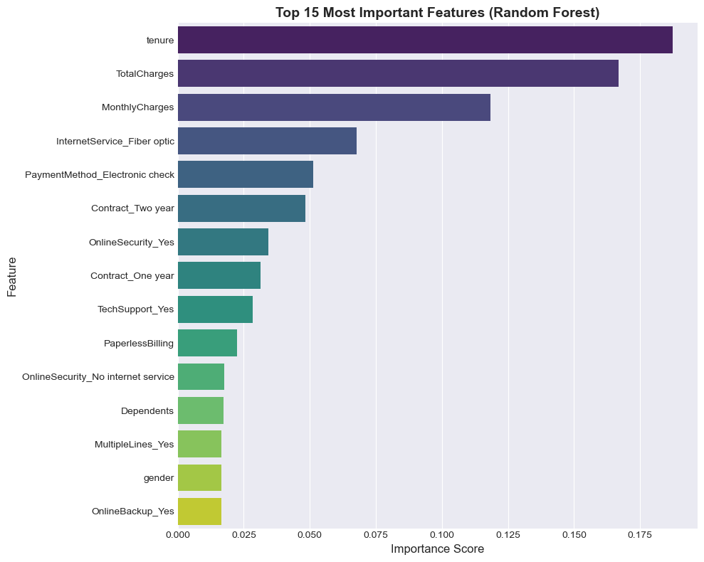

# 📉 Telco Customer Churn Prediction

Predicting **customer churn** using Machine Learning to help telecom companies reduce customer loss and improve retention strategies.

---

## 🧠  Business Problem

Customer churn is one of the biggest revenue risks in the telecom industry.  
Acquiring new customers costs significantly more than retaining existing ones.

Telecom companies need a data-driven system that can:

- Detect customers likely to leave  
- Understand *why* they leave  
- Take proactive retention actions  

This project builds a **machine learning solution** to predict churn and uncover the main drivers behind customer loss.

---

## 🎯  Project Objective

To develop a predictive model that identifies customers at high risk of churning using:

- Demographic data  
- Account information  
- Service subscription details  
- Billing and usage behavior  

The focus is on **Recall and F1-score**, since failing to identify a churner is more costly than a false alarm.

---

## 🗂  Dataset Overview

The dataset contains customer-level telecom information.

| Feature Category | Examples |
|------------------|---------|
| Demographics | Gender, Senior Citizen, Partner, Dependents |
| Account Info | Tenure, Contract Type, Payment Method |
| Services | Internet, Online Security, Tech Support |
| Billing | Monthly Charges, Total Charges |
| Target Variable | **Churn (Yes/No)** |

---

## 🔍  Exploratory Data Analysis (EDA)

EDA was performed to understand customer behavior patterns.

### 📊 Churn Distribution



### 🧑‍💼 Churn Distribution by Gender and Senior Citizen Status




### 📄 Churn by Contract Type
Customers with **month-to-month contracts** show the highest churn rate.




### 💰 Churn vs Monthly Charges
Higher monthly charges are associated with increased churn risk.


### ⏳ Tenure vs Churn
Longer tenure customers show strong loyalty and lower churn probability.


## ⚙️  Data Preprocessing

- Handled missing values  
- Encoded categorical variables  
- Scaled numerical features where required  
- Split data into training and testing sets  
- Prepared a model-ready dataset  

---

## 🧩  Feature Engineering

- Transformed contract and payment features  
- Structured tenure and charges variables  
- Created encoded dataset for machine learning models  

---

## 🤖  Machine Learning Models

Multiple algorithms were tested and compared.

| Model | Purpose |
|------|--------|
| Logistic Regression | Baseline model |
| Decision Tree | Interpretable classifier |
| Random Forest | Ensemble learning |
| K-Nearest Neighbors | Distance-based model |
| Support Vector Machine | Margin-based classifier |
| XGBoost | High-performance gradient boosting |

---

## 📊  Model Evaluation Strategy

Because churn datasets are often **imbalanced**, evaluation emphasized:

- **Recall** – Capture as many churners as possible  
- **F1-score** – Balance precision and recall  
- **ROC-AUC** – Overall model discrimination ability  
- Confusion Matrix – Understand prediction errors  

---

## 📈  Model Performance Comparison


## 🔲  Confusion Matrix







## 📌  Feature Importance

Key predictors of churn:

- Contract type  
- Tenure  
- Monthly charges  
- Online security  
- Tech support  





## 🏆  Key Insights

✔ Month-to-month contracts drive churn  
✔ Higher monthly charges increase churn risk  
✔ Lack of security/support services correlates with churn  
✔ Long-term customers are more loyal  

---

## 💼  Business Impact

This model can help telecom companies:

- Identify high-risk customers early  
- Offer targeted promotions  
- Improve retention strategies  
- Increase customer lifetime value  

---

## 🚀  How to Run

```bash
pip install -r requirements.txt
jupyter notebook "Telco Customer Churn.ipynb"
```

---

## 🔮  Future Improvements

- Handle class imbalance using **SMOTE**  
- Add **SHAP** for model explainability  
- Hyperparameter tuning  
- Deploy as a **Streamlit dashboard**  

---

## 👤  Author

**Syafiq Firdaus**  
Data Science | Machine Learning | Analytics  

---

⭐ If you found this project helpful, feel free to star the repository!
